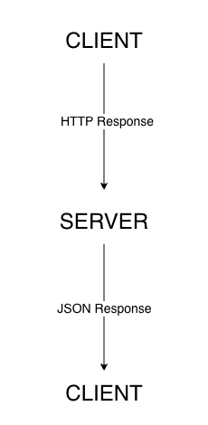

# How a REST API Works (Beginner-Friendly Guide)

## Overview 
An API (Application Programming Interface) allows software applications to communicate with each other.
Instead of interacting directly with a user interface, one program a request to another program and receives a response. 

REST APIs are one of the most common ways applications exchange data over the internet.

## What is REST?
REST stands for Representational State Transfer.
It is a design style that defines how applications should communicate using standard web protocols.

REST APIs typically use HTTP (Hypertext Transfer Protocol), the same protocol used by web browsers.


## Key REST Concepts

### Client and Server
In a REST API, the client is the application that sends a request.
The server is the application that receives and returns a response.

For example, a web browser can act as a client, while a backend service acts as the server.

### Requests and Responses 
Communication in a REST API happens through requests and responses.

A request contains:
- A URL (endpoint)
- An HTTP method
- Optional headers or data

The server processess the request and returns a response, which typically includes:
- A status code
- Response data in JSON (Javascript Object Notation)

REST APIs commonly exchange data using JSON.
JSON is a lightweight data format that represents information using key-value pairs.
It is easy for both humans and machines to read and write. 

In a REST API, the server typically returns responses in JSON format, allowing the client to easily parse and use the data.

Example responses:  
```json
[
 {
    "id": 1,
    "name": "Leanne Graham",
    "email": "leanne@example.com"
 }
]
```
Each object in the response represents a user.
The `id` field uniquely identifies the user's name.
The `name` field contains the user's name.
The `email` field contains the user's email address.

### HTTP Methods
HTTP methods define the action a client wants to perform on a resource. 

Common HTTP methods include:
- **GET**: Retrieve data from the server
- **POST**: Send new data to the server
- **PUT**: Update exisiting data
- **DELETE**: Remove data from the server

Each method represents a specific type of operation that can be performed on a resource.

### Status Codes 
HTTP status codes indicates whether a request was successful or failed. 

Common status codes include:
- 200 OK: The request was successful
- 404 Not Found: The requested resource does not exist
- 500 Internal Server Error: The server encountered an error

## How a REST API Works (Diagram)
This diagram shows how a client sends a HTTP request to a server and receives a JSON response.



## Additional Documentation 
- [Setup Guide](./setup-guide.md)
- [API Reference](./api-reference.md)
- [Troubleshooting Guide](./troubleshooting.md)

## Summary 
REST APIs allow applications to communicate using standard HTTP methods.
By sending requests and receiving structured responses, applications can exchange data efficiently.

## References 
- Mozilla Developer Network (MDN). (n.d.). REST. https://developer.mozilla.org/en-US/docs/Glossary/REST
- Github Docs. (n.d.). API Reference. Https://docs.github.com/en/rest

